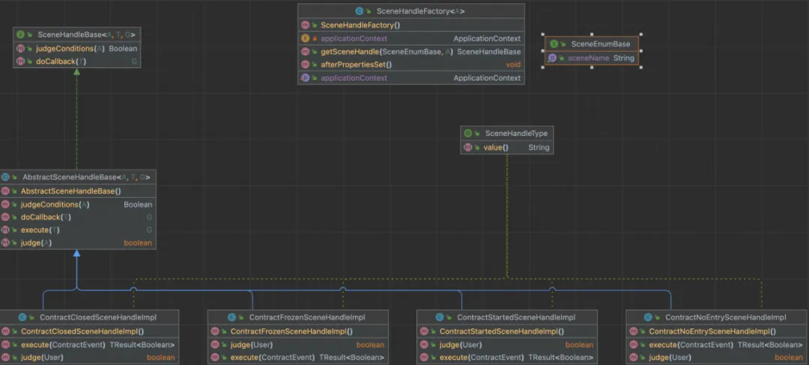

## 引言-应用背景

> 在软件开发实践中，面对复杂多变的业务场景，开发者常常需要设计灵活且可扩展的架构以应对“根据不同场景执行不同逻辑”的需求。本文以Java语言为背景，探讨了如何通过模式设计与工具化手段优化这一过程，旨在减少代码冗余，提升开发效率与代码质量。

## 1. 用途
在日常开发过程中，经常遇到“根据不同场景，做不同的处理”。如：对领红包而言，不满足领红包资格的用户返回“不满足资格”文案。有资格而未领取的用户，需要领红包、纪录、发对账消息等操作。已经领过红包的用户，执行xxx的操作。

为了避免流水账的代码，会使用各种模式，建立抽象类、具体实现类、工厂类等去解决此问题。使得增加新场景，也具有更好的代码的扩展性，如：领取红包的用户，新增是否过期、是否使用的场景。

更进一步，开发了场景执行工具，简化开发流程。

优点：
用户只需要撰写具体的实现类，其余接口、工厂类都不需要考虑。
简化开发流程，但上面提到的扩展性、可读性仍然存在。

## 2. 类图
#### 状态模型 + 工厂模式


## 3. 代码详解

现在有一个需求，用户要开通xx服务，返回开通结果消息。开通结果消息有很多状态：开通成功、解约成功、冻结等等。需要根据这个消息的状态去，做不同的行为。

很容易想到状态模式，先定义一个通用的状态处理接口，再根据开通状态去创建各种具体的状态实现类，实现doCallback方法。如此，我们写出来的代码具有很好的扩展性和可读性。

### 3.1 状态模式
#### 1.场景处理接口：
```java

public interface SceneHandleBase<A,T,G> {

    /**
     *  执行方法
     */
    G doCallback(T params) ;

}
```
#### 2. 场景抽象类：在场景处理接口基础之上，又封装了一层，主要用于打异常日志和监控
```java
@Slf4j
public abstract class AbstractSceneHandleBase<A, T, G> implements SceneHandleBase<A, T, G> {

    /**
     * 场景实现类的执行方法
     *
     * @param params
     * @return
     * @throws Exception
     */
    public abstract G execute(T params);


    /**
     * 打印执行异常日志,并监控异常
     */
    @Override
    public G doCallback(T params) {
        try {
            return execute(params);
        } catch (Exception e) {
            log.error("{}, |StatusHandleBase_doCallback|error|,className:{}, doCallback, params:{}, msg:{}", EagleEye.getTraceId(), this.getClass().getSimpleName(), JSON.toJSONString(params), e.getMessage(), e);
            throw e;
        }
    }

}
```
#### 3. 具体场景实现类：
   开通成功，执行写入签约表
```java
@Component
@Slf4j

public class ContractStartedSceneHandleImpl extends AbstractSceneHandleBase<User, ContractEvent, TResult<Boolean>> {

    @Resource
    private PurchasePayLaterBizService purchasePayLaterBizService;

    @Override
    public boolean judge(User params) {
        return true;
    }

    @Override
    public TResult<Boolean> execute(ContractEvent contractEvent) {
        UserSignResult userSignResult = purchasePayLaterBizService.buildUserSignResult(contractEvent, SignStatus.SIGN_SUCCESS);
        return purchasePayLaterBizService.updateSignStatus(userSignResult);
    }
}
```

解约成功，执行写入签约表
```java
@Component
@Slf4j
public class ContractClosedSceneHandleImpl extends AbstractSceneHandleBase<User, ContractEvent, TResult<Boolean>> {

    @Resource
    private PurchasePayLaterBizService purchasePayLaterBizService;

    @Override
    public boolean judge(User params) {
        return true;
    }

    @Override
    public TResult<Boolean> execute(ContractEvent contractEvent) {
        UserSignResult userSignResult = purchasePayLaterBizService.buildUserSignResult(contractEvent, SignStatus.SIGN_FAIL);
        return purchasePayLaterBizService.updateSignStatus(userSignResult);
    }
}
```
等等具体实现类......
这样写出来的代码，虽然简化了不少。我们仍然需要判断消息的状态，去执行不同具体实现类，在代码中还要写if/else。状态执行如：

```java
if(ContractStatusEnum.valueOf(contractEvent.getStatus())==ContractStatusEnum.STARTED){
    ContractStartedSceneHandleImpl.execute("x");
}else if(ContractStatusEnum.valueOf(contractEvent.getStatus())==ContractStatusEnum.CLOSE){
    contractClosedSceneHandleImpl.execute("x");
}
......
```
更进一步优化，很容易想到用工厂模式来管理这些实现类。

### 3.2 工厂模式

#### 场景注解
```java
/**
 * @author shaojie
 * @date 2024/07/10
 * 注解时使用枚举值地址，如：*.ContractStatusEnum.CLOSED
 */
@Retention(RetentionPolicy.RUNTIME)
@Target(ElementType.TYPE)
@Documented
public @interface SceneHandleType {

    String value();
}
```
在具体实现类上添加注解@SceneHandleType("CLOSED")
如此就可以通过工厂类，获取到实现类
```java
public class SceneHandleFactory<A> implements ApplicationContextAware, InitializingBean {

    private final Map<String, List<SceneHandleBase>> statusMap = new HashMap<>();
    private ApplicationContext applicationContext;

    @Override
    public void setApplicationContext(ApplicationContext applicationContext) throws BeansException {
        this.applicationContext = applicationContext;
    }

    /**
     * 工厂类初始化后，执行该方法
     * 获取StatusHandleBase所有的实现类
     * @throws Exception
     */
    @Override
    public void afterPropertiesSet() throws Exception {
        Map<String, SceneHandleBase> recommendStrategyMap = applicationContext.getBeansOfType(SceneHandleBase.class);
        if (MapUtils.isEmpty(recommendStrategyMap)) {
            return;
        }
        for (SceneHandleBase strategy : recommendStrategyMap.values()) {
            SceneHandleType statusType = strategy.getClass().getAnnotation(SceneHandleType.class);
            if (null == statusType) {
                continue;
            }
            String statusValue = statusType.value();
            if (null == statusValue) {
                continue;
            }
            statusMap.put(statusValue, strategy);
        }

    }

    /**
     * 获取具体场景处理类
     *
     * @param status
     * @return
     */
    public SceneHandleBase getSceneHandle(String status) {
        return statusMap.get(statusType);
    }

}

```
状态执行就变成：
```java
statusHandle = statusFactory.getSceneHandle(contractEvent.getStatus();
TResult<Boolean> res = statusHandle.doCallback(contractEvent);
```
到了这里，整个执行方法就变的非常简洁，以后新增了一个开通状态，也只需要加一个实现类，代码的扩展性也得到了保证。

但类似的情况非常多，如开头讲到的领红包情况，每遇到一次都要写一堆代码，去实现工厂类，注解，抽象接口等等，将会浪费很多时间。

故更进一步，如果能抽出来一个通用的场景执行器，用户只需要考虑实现类，其余的接口、工厂类都给实现了，那岂不是大大提高效率。

### 3.3 通用场景执行器
首先，不能再使用“CLOSED”作为注解的值了，@SceneHandleType("CLOSED")。一个系统里，可能有很多业务使用场景执行器，这样起名无法统一管理，容易重名，工厂类也不易根据注解值拿到实体类。

所以这里通过场景枚举去管理本次业务的各种场景，不同业务，通过不同的场景枚举做隔离。用枚举值的全地址作为注解值。这样就保证了注解值的“唯一性”。

如此，工厂类获取具体实现类的入参就是枚举值了，和具体场景实现类一样。为了工厂类的通用性，还需要一个场景枚举接口，用于工厂类方法的入参。

#### 场景枚举接口
枚举类会实现此接口，getSceneName方法是为了获取枚举值的name，用于拼接枚举值全地址。
```java
public interface SceneEnumBase {

    /**
     * 获取实现枚举类的属性名称
     * @return
     */
    String getSceneName();
}
```
#### 开通状态枚举类：
“具体场景实现类”上的注解@SceneHandleType值就是对应的枚举值全地址。

枚举值是什么？
- 这里的枚举值是if(x){y}中的x，将条件映射为一个枚举值。
- 如果“未领取红包”，用户“去领红包”。那么这个枚举值就是“未领取红包”，“去领取红包”是具体执行类中的execute。
- 也可以是开通结果枚举的一个状态值。
```java
public enum ContractStatusEnum implements SceneEnumBase {
    /**
     * 生效中
     */
    STARTED,

    /**
     * 冻结
     */
    FROZEN,

    /**
     * 退出
     */
    CLOSED,

    /**
     * 没有开过
     */
    NO_ENTRY;

    /**
     * 获取实现枚举类的属性名称
     * @return
     */
    @Override
    public String getSceneName() {
        return this.name();
    }
} 
```
#### 具体场景实现类
注解是枚举值全地址
```java
@SceneHandleType("*.ContractStatusEnum.CLOSED")
@Component
@Slf4j
public class ContractClosedSceneHandleImpl extends AbstractSceneHandleBase<User, ContractEvent, TResult<Boolean>> {
......
```
#### 状态处理工厂类
获取具体实现类的方法

```java
public class SceneHandleFactory<A> implements ApplicationContextAware, InitializingBean {
    ......
public SceneHandleBase getSceneHandle(SceneEnumBase status) {
        String statusType = String.join(".", status.getClass().getName(), status.getSceneName());//拼接出枚举全地址
        return statusMap.get(statusType);
    }
}
```
对于同一个场景枚举值，可能不止一个行为。如：用户已领取红包，这个红包已使用，执行a行为，红包未使用执行b行为。

此时，就用上了场景抽象接口的judgeConditions方法，此方法会在工厂类获取bean的方法中，选择合适的场景实现类。
```java
public interface SceneHandleBase<A,T,G> {

    /**
     * 同一个枚举值若有多个场景实现类，可通过此方法判断使用哪个场景实现类
     */
    Boolean judgeConditions(A params);

    /**
     *  执行方法
     */
    G doCallback(T params) ;

}
```
工厂类
```java
public class SceneHandleFactory<A> implements ApplicationContextAware, InitializingBean {

    private final Map<String, List<SceneHandleBase>> statusMap = new HashMap<>();
    private ApplicationContext applicationContext;

    @Override
    public void setApplicationContext(ApplicationContext applicationContext) throws BeansException {
        this.applicationContext = applicationContext;
    }

    /**
     * 工厂类初始化后，执行该方法
     * 获取StatusHandleBase所有的实现类
     * @throws Exception
     */
    @Override
    public void afterPropertiesSet() throws Exception {
        Map<String, SceneHandleBase> recommendStrategyMap = applicationContext.getBeansOfType(SceneHandleBase.class);
        if (MapUtils.isEmpty(recommendStrategyMap)) {
            return;
        }
        for (SceneHandleBase strategy : recommendStrategyMap.values()) {
            SceneHandleType statusType = strategy.getClass().getAnnotation(SceneHandleType.class);
            if (null == statusType) {
                continue;
            }
            String statusValue = statusType.value();
            if (null == statusValue) {
                continue;
            }
            List<SceneHandleBase> list = statusMap.getOrDefault(statusValue, new ArrayList<>());//同一个注解值，可以对应多个场景实现类
            list.add(strategy);
            statusMap.put(statusValue, list);
        }

    }

    /**
     * 根据条件判断，获取具体场景处理类
     *
     * @param status
     * @return
     */
    public SceneHandleBase getSceneHandle(SceneEnumBase status, A params) {
        String statusType = String.join(".", status.getClass().getName(), status.getSceneName());
        List<SceneHandleBase> bases = statusMap.get(statusType);
        if (CollectionUtils.isNotEmpty(bases)) {
            for (SceneHandleBase base : bases) {
                if (base.judgeConditions(params)) {//筛选场景实现类
                    return base;
                }
            }
        }
        return null;
    }

}
```
## 4. 使用
#### 添加依赖
```xml
<dependency>
  <groupId>*</groupId>
  <artifactId>*</artifactId>
  <version>*</version>
</dependency>
```
#### 注入工厂bean
```java
    @Bean
    public SceneHandleFactory getStatusHandleFactory() {
        return new SceneHandleFactory();
    }
```
#### 根据条件定义场景枚举，并implements SceneEnumBase，getSceneName方法直接copy
```java
public enum ContractStatusEnum implements SceneEnumBase {
    /**
     * 生效中
     */
    STARTED,

    /**
     * 冻结
     */
    FROZEN,

    /**
     * 退出
     */
    CLOSED,

    /**
     * 没有开过
     */
    NO_ENTRY;

    /**
     * 获取实现枚举类的属性名称
     * @return
     */
    @Override
    public String getSceneName() {
        return this.name();
    }
}
```
#### 场景实现类：
##### 1. 添加注解
@Component

@StatusHandleType("*.CJCreditContractStatusEnum.CLOSED")

引号中是枚举全地址+枚举值
##### 2. 实现两个方法
judge()：同一个枚举值可以设置多个实现类，工厂类获取具体实现类时，根据此方法获取此枚举值的实现类
execute()：具体实现类的实现方法
```java
@StatusHandleType("*.ContractStatusEnum.CLOSED")
@Component
@Slf4j
public class ContractClosedSceneHandleImpl extends AbstractSceneHandleBase<User, ContractEvent, TResult<Boolean>> {

    @Resource
    private PurchasePayLaterBizService purchasePayLaterBizService;

    @Override
    public boolean judge(User params) {
        return true;
    }

    @Override
    public TResult<Boolean> execute(ContractEvent contractEvent) {
        UserSignResult userSignResult = purchasePayLaterBizService.buildUserSignResult(contractEvent, SignStatus.SIGN_FAIL);
        return purchasePayLaterBizService.updateSignStatus(userSignResult);
    }
}

```
#### 调用工厂类获取具体实现类，并执行方法
```java

SceneHandleBase<User, ContractEvent, TResult<Boolean>> statusHandle = statusFactory.getSceneHandle(ContractStatusEnum.valueOf(contractEvent.getStatus()),null);
TResult<Boolean> res = statusHandle.doCallback(contractEvent);
```

## 5. 总结
本文通过逐步深入的实践案例，阐述了从原始的条件分支逻辑到运用设计模式优化，最终实现高度抽象化的场景执行工具的全过程。这一过程不仅展示了技术深度，更重要的是体现了面向对象设计原则的应用价值，即通过高内聚低耦合的设计提升软件系统的灵活性与可扩展性。

场景执行工具的提出，极大地减轻了开发者在面对多变业务场景时的编码负担，允许他们更加专注于业务逻辑的实现，而非繁琐的架构搭建，使得整个解决方案既强大又易于集成。


